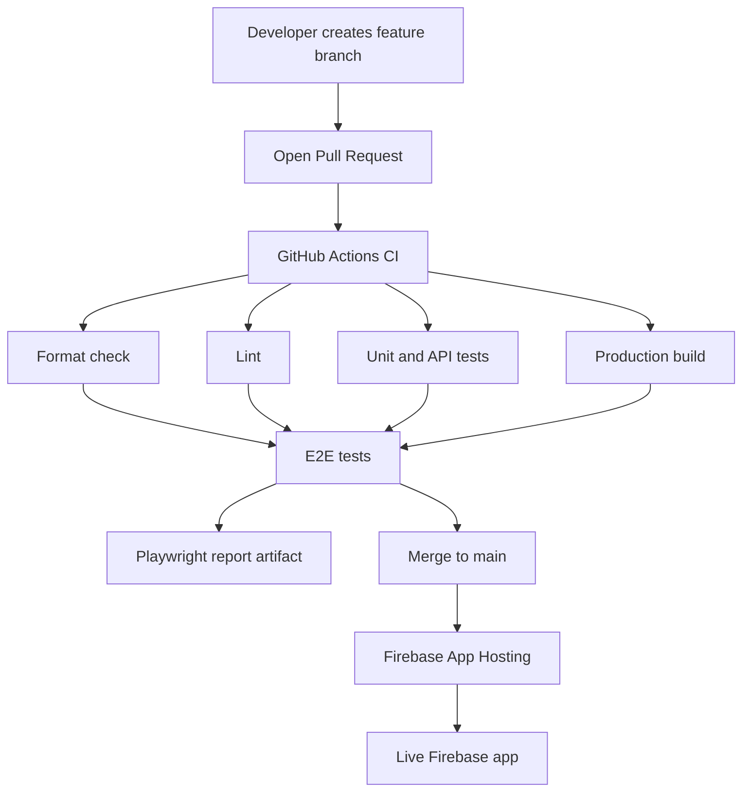

# QA CI/CD Lab

[](https://github.com/x-dal/QA-CI-CD-LAB/actions/workflows/ci.yml)

## What this project demonstrates

This project shows a basic QA-focused CI pipeline.

The pipeline runs automatically on every push and pull request to `main`.

## CI pipeline steps

1. Checkout code
2. Setup Node.js
3. Install dependencies using `npm ci`
4. Run lint checks
5. Run unit tests
6. Run API tests
7. Run production build
8. Run Playwright E2E tests
9. Upload Playwright HTML report as artifact

## Test types

### Unit tests

Unit tests are written with Vitest.

### API tests

API tests validate the `/api/health` endpoint.

### E2E tests

End-to-end tests are written with Playwright and run against the local Next.js app.

## Why this matters

This project demonstrates how automated quality gates can help detect issues before code is merged or deployed.

## Git workflow used in this project

This project follows a simple pull request workflow:

1. Create a new branch from `main`
2. Make changes on the branch
3. Push the branch to GitHub
4. Open a pull request into `main`
5. GitHub Actions runs CI checks
6. Merge only when checks pass
7. Firebase App Hosting deploys from `main`

## Common commands

Create a new branch:

```bash
git checkout main
git pull origin main
git checkout -b my-feature-branch
```

## Deployment flow

This project uses Firebase App Hosting for deployment.

### Current deployment setup

- The app is deployed to Firebase App Hosting.
- The live test environment is:
  https://my-web-app--qa-ci-lab-test.us-east4.hosted.app/
- Firebase App Hosting is connected to the GitHub repository.
- When changes are merged to `main`, Firebase App Hosting can build and deploy the latest version.

### CI/CD flow

```text
Feature branch
↓
Pull Request
↓
GitHub Actions CI
↓
Format check
↓
Lint
↓
Unit/API tests
↓
Production build
↓
Playwright E2E tests
↓
Merge to main
↓
Firebase App Hosting deploy
```

## CI/CD architecture



## Lessons learned

During this project, I practiced and learned:

### Git and GitHub

- How to create and switch branches
- How to push changes to remote branches
- How to open pull requests
- How to recover when changes are committed on the wrong branch
- How to use pull requests as a quality gate before merging to `main`

### GitHub Actions

- How to create a CI workflow
- How to run workflows on `push`, `pull_request`, and `workflow_dispatch`
- How to split a workflow into multiple jobs
- How to use job dependencies with `needs`
- How to use environment variables and GitHub Secrets
- How to upload Playwright reports as artifacts
- How to add CI summaries

### Testing

- How to run lint checks
- How to run unit tests with Vitest
- How to test an API endpoint
- How to run E2E tests with Playwright
- How to capture screenshots, videos, and traces on failure
- How to separate local E2E tests from live smoke tests

### Deployment

- How to deploy a Next.js app to Firebase App Hosting
- How Firebase App Hosting connects to GitHub
- How CI checks and deployment can run as separate processes
- Why production deployments should happen only after quality checks pass

## Roadmap

### Completed

- Basic GitHub Actions CI workflow
- Lint check
- Prettier format check
- Unit tests with Vitest
- API test for `/api/health`
- Playwright E2E tests
- Playwright reports as GitHub artifacts
- Screenshots, videos, and traces on failure
- Production build check
- Manual workflow trigger
- Environment input for manual runs
- GitHub Secrets usage
- Firebase App Hosting deployment
- Pull request workflow
- Dependabot configuration
- PR and issue templates

### Next improvements

- Add more realistic user-flow E2E tests
- Add staging/production URL selection for live smoke tests
- Add GitHub environment approvals
- Add test result summary from Vitest
- Add Docker build check
- Add release versioning
- Add rollback documentation
- Add monitoring/logging notes

## Docker

This project includes a Dockerfile to verify that the app can be built inside a clean container environment.

### Build Docker image locally

```bash
docker build -t qa-ci-lab .
```

Initial CI/CD learning release.

Includes:

- GitHub Actions CI
- Prettier format check
- ESLint
- Vitest unit/API tests
- Playwright E2E tests
- Docker build check
- Firebase App Hosting deployment

## Releases

This project uses Git tags and GitHub Releases to mark stable versions.

### Current release

- `v0.1.0` - Initial CI/CD Lab

### Release process

1. Make sure `main` is updated
2. Run local quality checks
3. Create a version tag
4. Push the tag to GitHub
5. Create a GitHub Release from the tag

```bash
git checkout main
git pull origin main
npm run quality
git tag v0.1.0
git push origin v0.1.0
```

## Rollback strategy

A rollback means returning the application to a previous stable version if a new deployment has a problem.

### Current rollback options

Because this project uses Firebase App Hosting and GitHub, rollback can be handled by:

1. Reverting the problematic commit
2. Opening a pull request with the revert
3. Waiting for CI to pass
4. Merging to `main`
5. Allowing Firebase App Hosting to deploy the fixed version

### Git revert example

```bash
git checkout main
git pull origin main
git revert <commit-sha>
git push origin main


```
